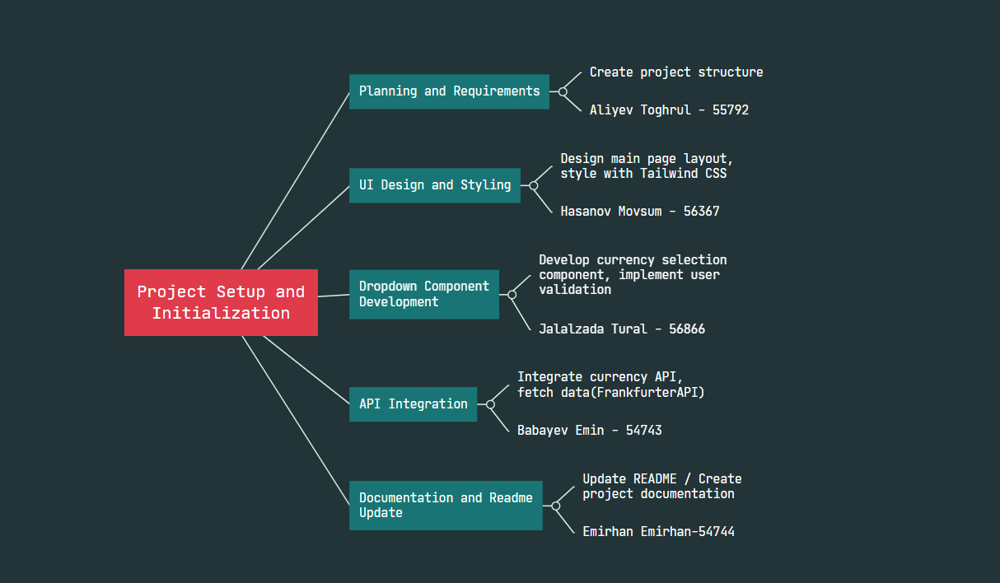

<<<<<<< HEAD


# Currency Converter Project

## Project Overview

This project is a currency converter application built using React and Vite. It integrates with a currency exchange API to fetch real-time exchange rates and allows users to convert between different currencies.

## Features

- Fetches real-time exchange rates using the Frankfurter API.
- Converts between various currencies.
- Simple and intuitive UI with dropdowns for currency selection.
- Error handling for API requests and user input.

## Installation

1. **Clone the repository:**
   ```bash
   git clone https://github.com/Tugrul99/55792_56866_54740_56367_54743.git
   ```
2. **Navigate to the project directory:**
   ```bash
   cd 55792_56866_54740_56367_54743-main
   
   ```
3. **Install Vite:**
   ```bash
   npm install vite
   ```
4. **Install the dependencies:**
   ```bash
   npm install
   ```

## Usage

Start the development server:
   ```bash
   npm run dev
   ```
Open your browser and go to `http://localhost:3000` to view the app.

## Presentation


```

=======
# Currency Converter

## Project Description
Currency Converter is an application that allows converting between different currencies. Users can convert a specified amount between selected currencies.

## Features
- Convert between different currencies
- Dropdown menus for selecting currencies
- Fetches live exchange rates from an API
- User-friendly and fast interface

## Installation and Setup
Follow these steps to run the project locally:

1. **Clone the Repository:**
    ```bash
    git clone https://github.com/Tugrul99/55792_56367.git
    ```

2. **Navigate to the Project Directory:**
    ```bash
    cd 55792_56367
    ```

3. **Install Required Packages:**
    ```bash
    npm install
    ```

4. **Start the Application:**
    ```bash
    npm start
    ```

5. **Run the Tests:**
    ```bash
    npm test
    ```

## Technologies Used
- **React:** For building the user interface.
- **Tailwind CSS:** For styling and layout.
- **Jest:** For testing.
- **React Testing Library:** For component testing.

## Project Structure
The project files and directory structure are as follows:
55792_56367/
├── public/
│ ├── index.html
│ └── ...
├── src/
│ ├── assets/
│ │ ├── Dropdown.jsx
│ │ └── ...
│ ├── tests/
│ │ ├── CurrencyConverter.test.js
│ │ └── Dropdown.test.js
│ ├── CurrencyConverter.jsx
│ └── ...
├── package.json
└── README.md

## Key Components and Their Functions
- **CurrencyConverter.jsx:** Manages the currency conversion logic and user interface.
- **Dropdown.jsx:** Component used for selecting currencies via dropdown menus.

## Testing Instructions
To run the tests, use the following command:
```bash
npm test
>>>>>>> 554bbaeabd27892b5f4c16cab68b5b67950edcf8
